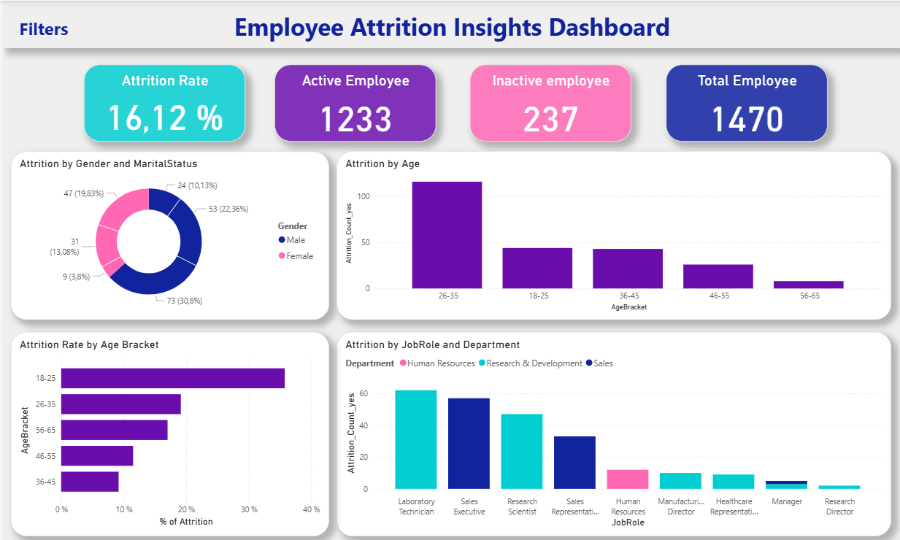

# Predict Employee Attrition

This project is designed to analyze employee behavior patterns and their relation to attrition rates. It aims to help employers make informed decisions and plan for timely intervention measures. The project utilizes a synthetic dataset that mirrors real-world nuances such as work-life balance, travelling distances, and others.

The analysis includes data extraction, transformation, statistical testing, and visualization built using Python and its libraries such as pandas. We have contextualized the business implications considering the synthetic nature of the data.

## Dataset Content
This project uses multiple datasets and processed versions relating to employee attrition:
* WA_Fn-UseC_-HR-Employee-Attrition.csv: The original dataset containing HR data such as demographics, work conditions, and attrition labels.
* predict_employee_attrition_copy.csv: A cleaned copy of the original dataset, prepared for exploration.
* predict_employee_attrition_transformed.csv: The transformed dataset including derived features (e.g., age brackets, total satisfaction index) to support deeper analysis.

The datasets contain 1,470 employee records with 34 attributes covering demographics, job role, income, tenure, work-life balance, satisfaction metrics, and attrition outcomes.

## Business Requirements
* Identify key drivers of employee attrition across departments, roles, and demographics.
* Build a structured workflow (load → transform → extract → analyze) that allows reproducibility.
* Provide insights to guide HR policies and improve employee retention.
* Develop dashboard visuals to communicate attrition patterns and predictors.

## Hypotheses and research methodology
The project tests the following five hypotheses:

|Index|Hypotheses|method|p-value|Interpreation|
|-----|----------------|-------------------------|-------------|-------|
|1|Gender and Attrition|Chi-squared|0.2|Accept null|
|2|Age and Attrition|Chi-squared_contingency|0.0|Reject null|
|3| Department and Attrition|Chi-squared|0.0|Reject null|
|4|Monthly income and Attrition|MWU|0.00|Reject null|
|5|Total satisfaction level and Attrition|MWU|0.0|Reject null|
|5.1|JobSatisfaction and Attrition|MWU|0.0|Reject null|

## Project Plan
* Data Collection: Gather raw HR dataset (WA_Fn-UseC_-HR-Employee-Attrition.csv).
* Data Loading: Initial load performed in predict_employee_attrition_extract.ipynb.
* Data Transformation: Feature engineering and cleaning in predict_employee_attrition_transform.ipynb.
* Analysis & Interpretation: Hypothesis testing, visualisation, and business impact assessment.
* Dashboarding: Further data transformation (Measures) for visualisation in PowerBI.

The chosen methodology ensures reproducibility and traceability across stages of the ETL pipeline.

## Team structure
We divided the workload equally to ensure everyone contributed to the ETL process. However, we also held an additional role.

|Name|Responsibile|Accountable|Consulted|Informed|
|-------|-----|------|--------------|------------|
|Payal|ETL|Dashboaring|Readme|ETL|
|Petal|ETL|Readme|Dashboarding|ETL|
|Naren|ETL|Project|Transform|Dashboarding|

## Analysis techniques used
* Chi-square tests: For categorical independence testing.
* Mann-Whitney U Test: For numerical features.
* Correlation analysis: To assess linear relationships between satisfaction, income, and attrition.
* Data visualisation: Bar charts, histograms, boxplots for pattern discovery.
* Feature engineering: Creating new variables (e.g., Age Bracket, Total Satisfaction index).

Limitations: Dataset is relatively small (1,470 rows) and the data was engineered (synthetically generated), limiting generalisability. Certain categories (such as Attrition, Department) are biased as they have low representation of one particular value, which impacts statistical robustness.

Generative AI was used to:

* Ideate hypothesis-testing approaches.
* Suggest dashboard layouts and visualisation techniques.
* Optimise code readability and structure.

## Ethical considerations
* Data Privacy: The dataset is anonymised and synthetic; no personal identifiers are included.
* Bias/Fairness: Representation imbalances (e.g., small HR sample) may bias interpretations.
* Societal Considerations: Analysis focuses on fairness and preventing biased HR decision-making.

## Dashboard
We used PowerBI to build a dashboard. To review the dashboard, please download the .pbix file from the [# dashboard] folder and open it locally on your system.

## Dashboard Design: Rationale
1. Overview: Attrition trends across features. 
2. Workforce Demographics and Compensation: Attrition trends across demographics and workplace dynamics.
3. Employee Engagement and Satisfaction: Employee satisfaction across various engagement metrics.

Communication: Visuals were designed for non-technical HR managers with tooltips, labels, and interactivity. Technical audiences can further query Jupyter notebook outputs. 

## Rationale to map Business Requirements to the Data Visualisations
Build a narrative by first introducing the stakeholders to the basic metrics, such as the count of attrition and attrition percentage by different factors. Following that, we dive deep into the workplace dynamics that impact attrition. Finally, we close with factors that impact engagement and satisfaction, helping the stakeholders with a clear path for action.

## Unfixed Bugs
* Some categorical values in the original dataset (e.g., Department, Gender, Attrition) are biased, making certain statistical results less reliable.
* Visualisation scaling issues may arise in Power BI when comparing small vs large departments.
* Feedback from peers led to adjustments in feature engineering (e.g., Age Brackets), but some improvements remain ongoing.

## Development Roadmap
* Challenges: Handling categorical imbalance and ensuring statistical significance.
* Strategies: Use both proportions and raw counts, and validate findings with multiple metrics.
* Next Skills: Handle data bias, explore predictive modelling (e.g., logistic regression, random forests) for attrition prediction, and improve Power BI dashboard interactivity with DAX measures.

## Main Data Analysis Libraries
* pandas: Data manipulation and cleaning (read_csv, groupby, feature creation).
* numpy: Numerical transformations.
* matplotlib, seaborn, and plotly: Visualisation of attrition patterns.
* pingouin: Hypothesis testing (Mann-Whitney U Test)
* scipy.stats: Hypothesis testing (Chi-square).

## Credits 
### Content 

- Base dataset: Kaggle [IBM HR Analytics Employee Attrition & Performance Dataset](https://www.kaggle.com/datasets/pavansubhasht/ibm-hr-analytics-attrition-dataset/data)
- Guidance on Chi-square testing: SciPy documentation
- Code structuring best practices: Inspired by open-source HR analytics notebooks

### Media

- Code Institute CI logo provided via their asset repository

## Acknowledgements
* Kaggle: Derived the source dataset from [Kaggle](https://www.kaggle.com/datasets/pavansubhasht/ibm-hr-analytics-attrition-dataset/data)
* Thanks to our facilitator, Emma Lamont, for her availability and feedback during the hackathon.
* Code Institute: For creating and providing this opportunity.
* GitHub: For providing a versioning tool that creates a seamless workflow.
* ChatGPT and GitHub Copilot: For inspiring us with ideas and co-creating code.
